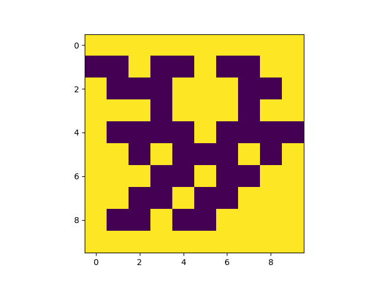
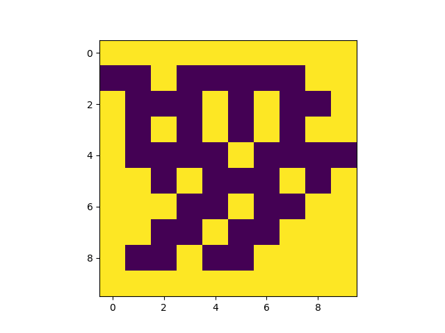

# HetSys Maze Solving Coding Challenge

This HetSys Coding Challenge is about the classic problem of solving a maze: rapidly finding a path from the entrance to the exit. There are two main challenges: Finding the shortest path from entrance to exit, and escaping the maze.

## Maze Specifics


Mazes are all generated with a single opening on the left and right edges. The mazes are 2D boolean arrays, where the value `True` represents a wall (yellow on the plot). 

The above plot is an example of a "Minimum Spanning Tree"-type maze, as its graph representation forms a Minimum Spanning Tree. 

The mazes can also be generated to have internal loops, such as the example shown below. These mazes may require more sophisticated algorithms to solve correctly, and are generally harder problems.



## Generating a Maze
`maze_generator.py` contains the `generate_maze()` function, which will be used as the default maze generation tool. It accepts args controlling the dimensions of the maze, and `p`, which controls the probability of a valid loop being created ($0 \leq p \leq 1$).

"Valid" loops are when, by removing a wall, a loop can be created without making a square of maze (i.e. 4 pixels arranged in a square, and none being a wall). This restriction is mainly included as a design choice, both to prevent excessive low-weight paths in the maze, and also to prevent large open spaces forming.

## Challenges
### Challenge 1: Shortest Path through a Maze
Given the full maze, find the shortest path from the entrance to the exit, in the shortest time possible.

Useful resources:
- [Wikipedia: Shortest path algorithms](https://en.wikipedia.org/wiki/Shortest_path_problem#Algorithms)
- [Computerphile video on Dijkstra's Algorithm](https://www.youtube.com/watch?v=GazC3A4OQTE)
- [Computerphile video on maze solving](https://www.youtube.com/watch?v=rop0W4QDOUI)


Starting Point:
This kind of problem can be rewritten as finding the shortest path between two points on a graph. As such, the algorithms used to solve mazes are graph-solving methods. A good first step would be to write a function to turn a maze into a graph, and then applying common algorithms there.

### Challenge 2: Maze Traversal
Given information about where walls are around a current pixel, successfully navigate an unseen maze (i.e. traversing to the exit) by issuing a series of move commands to traverse the maze.

To do this, implement a class which takes no args in its `__init__()` method. The class should have a method called `advance()`, which takes an array of bools corresponding to whether there is a wall (`True`) or not, and should return an integer indicating the direction to advance. The variables `left`, `right`, `up` and `down` are included in the `maze_traversal.py` module to help with specifying the advance integer, and to help index the input array. Here, the directions are absolute, and map to the way the mazes are plotted.

To test your class on a maze, adapt the following code:

```Py
from maze_generator import generate_maze
from maze_traversal import MazeTraverser, left, right, up, down


# Dumb algorithm that always goes left, even if there is a wall
class MazeSolver():
    def advance(self, walls):
        # Walls is a len 4 array of bools
        # Can use walls[left] to check if there
        # is a wall to the left

        # Go left, even if there is a wall there 
        # (will likely fail to solve the maze)
        # Submit a move by returning a direction
        return left

# Generate a 10x10 minimum spanning tree (MST) type maze
# Can use np.random.seed to seed the generation for reproducibility
maze = generate_maze(10, 10, 0.0)

trav = MazeTraverser(maze)

solver = MazeSolver()

# Pass in instantiated solver
# Returns True if solver reached the exit
result  = trav.solve(solver)

if result:
    print("Maze solved successfully")
else:
    print("Maze solve failed")
```

MazeTraverser also includes the `solve_with_plotting()` function, which can animate the progress throughout the solve (NOTE: This gets very slow for large mazes). Feel free to adapt this to suit your needs!

### Sub-challenges
There are two levels of difficulty to this challenge, based on whether `random_start` is True or False.

`random_start=False` will start the problem at one of the openings, with the challenge being to navigate to the other opening. `random_start=True` instead places you somewhere within the maze, with one of the openings now filled. Escaping these mazes may be more difficult, especially in the `p>0` case.

To escape mazes with a random starting position, more advanced algorithms are required.

Useful Resources:
- [Wikipedia: Maze Solving Algorithm](https://en.wikipedia.org/wiki/Maze-solving_algorithm)

Starting Point:
Left- and Right-turn algorithms work very well in the `p=0` case, and can also solve `p>0` mazes when the starting point is on the perimeter of the maze - these would be a good place to start!
